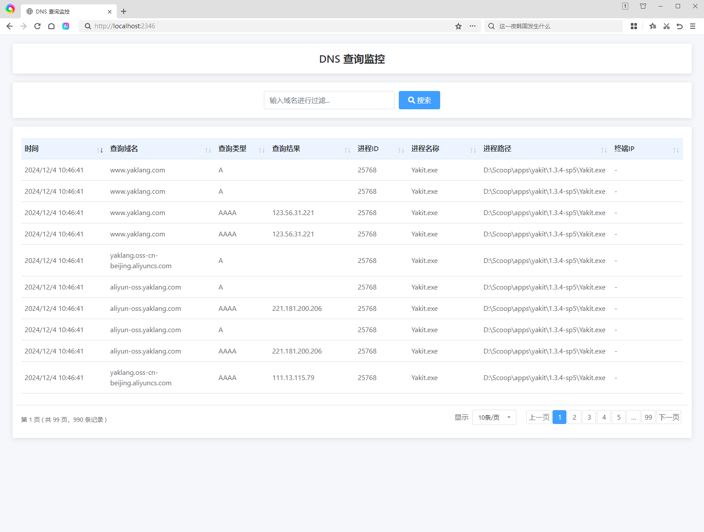

<div align="center">
<h1>dnsflux</h1>

使用 golang 编写的用于 Windows 和 Linux 平台的 DNS 查询请求监控工具。

<div>

[](https://github.com/whoopscs/dnsflux)
[](https://github.com/whoopscs/dnsflux)
[](https://github.com/whoopscs/dnsflux/releases)
[](https://mit-license.org/)

</div>

<div>

中文 ｜ [English](README_EN.md)

</div>
</div>

---


## 项目介绍

dnsflux 主要用于应急响应时，通过恶意域名检测定位到受害主机，但由于恶意进程生命周期短等原因，导致无法定位到恶意程序。通过实现监控DNS查询请求的同时记录进程等信息，辅助快速定位恶意程序。

- Windows 平台基于ETW事件，通过“Microsoft-Windows-DNS-Client”提供程序的事件跟踪，捕获ID为3008（已完成的查询）的事件。
- Linux 平台基于eBPF技术，通过加载过滤程序捕获内核网络数据包，从中解析DNS查询信息。

## 使用方法

任意平台都支持命令行实时输出日志或Web界面可视化(默认端口：2346)，条件允许的情况下更推荐使用Web界面可视化。




### Windows

Release下载可执行文件，双击运行。

### Linux
> Linux 平台需要在特权模式或者 root 用户下运行。

```
sudo dnsflux
```

## 支持项目

如果您发现 dnsflux 有用，您可以通过向作者捐赠来表达您的感激之情，激励他们继续更新和改进它！

<div align=center>

</div>


## 免责声明

本工具仅用于教育目的，只能在授权的渗透测试环境中使用。未经授权访问或使用不属于您的系统均属非法行为。作者对任何滥用本工具的行为概不负责。


## 许可证

本项目采用 [MIT](./LICENSE) 许可。


## Star History

<div align="center">

[](https://starchart.cc/whoopscs/dnsflux)

</div>