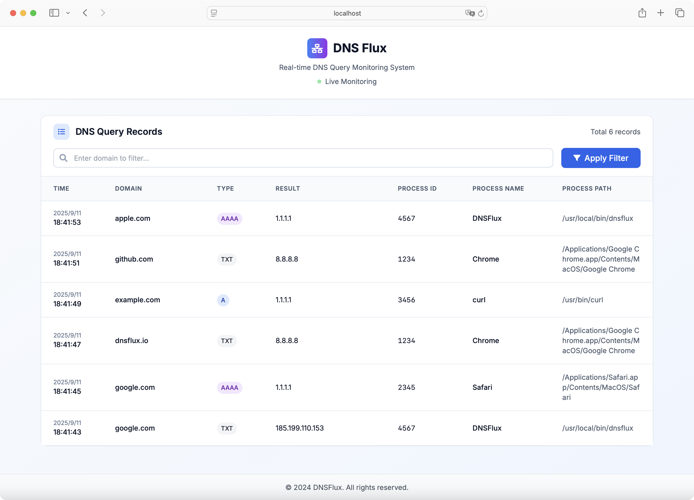

<div align="center">
<h1>DNS Flux</h1>

<p>跨平台 DNS 查询监控工具，支持 Windows 和 Linux 系统</p>

<p>
  <a href="https://mit-license.org/">
    
  </a>
  <a href="https://github.com/whoopscs/dnsflux">
    
  </a>
  <a href="https://github.com/whoopscs/dnsflux">
    
  </a>
  <a href="https://github.com/whoopscs/dnsflux/releases">
    
  </a>
</p>

<div>

中文 ｜ [English](README.md)

</div>
</div>

---

## 📖 项目介绍

DNSFlux 是一个高性能的跨平台 DNS 查询监控工具，专为网络安全分析、应急响应和恶意域名检测而设计。通过实时监控 DNS 查询请求并记录详细的进程信息，帮助安全分析师快速定位恶意程序和可疑网络活动。

### 🎯 核心价值

- **应急响应支持**：通过恶意域名检测快速定位受害主机
- **进程关联分析**：记录 DNS 查询的进程信息，辅助恶意程序定位
- **实时监控**：提供命令行和 Web 界面两种监控方式
- **跨平台兼容**：支持 Windows 和 Linux 主流操作系统

## 🏗️ 技术架构

### Windows 平台
- **技术栈**：基于 ETW (Event Tracing for Windows) 事件追踪
- **数据源**：Microsoft-Windows-DNS-Client 提供程序
- **事件类型**：捕获 ID 为 3008 的已完成查询事件
- **权限要求**：普通用户权限即可运行

### Linux 平台
- **技术栈**：基于 eBPF (Extended Berkeley Packet Filter) 技术
- **数据源**：内核网络数据包捕获和解析
- **监控点**：udp_sendmsg 和 tcp_sendmsg 系统调用
- **权限要求**：需要 root 权限或特权模式

### 系统组件

```
┌─────────────────┐    ┌──────────────────┐    ┌─────────────────┐
│   平台采集器     │───▶│    内存存储        │───▶│   Web 服务器     │
│ (ETW/eBPF)      │    │   (Ring Buffer)  │    │  (HTTP API)     │
└─────────────────┘    └──────────────────┘    └─────────────────┘
         │                       │                       │
         ▼                       ▼                       ▼
┌─────────────────┐    ┌──────────────────┐    ┌─────────────────┐
│   DNS 查询      │    │   控制台输出       │    │   Web 界面       │
│   JSON 日志     │    │   实时日志         │    │   可视化面板      │
└─────────────────┘    └──────────────────┘    └─────────────────┘
```

## ✨ 功能特性

### 🔍 DNS 监控
- **实时捕获**：监控所有 DNS 查询请求（A、AAAA、CNAME、MX 等记录类型）
- **进程关联**：记录发起查询的进程名称、路径和 PID
- **查询详情**：包含查询域名、类型、结果和响应时间
- **状态跟踪**：监控查询成功、失败和错误状态

### 📊 数据输出
- **控制台输出**：实时显示格式化的 DNS 查询日志
- **JSON 存储**：自动保存查询记录到 JSON 文件
- **Web 界面**：提供现代化的可视化监控面板
- **内存缓存**：高效的环形缓冲区存储（默认 5000 条记录）

### 🌐 Web 界面
- **实时数据表格**：动态显示 DNS 查询记录
- **搜索过滤**：支持域名、进程名等多字段搜索
- **数据统计**：显示总记录数和实时统计信息
- **响应式设计**：适配桌面和移动设备

### ⚙️ 配置选项
- **命令行参数**：支持丰富的启动参数配置
- **环境变量**：支持通过环境变量进行配置
- **日志级别**：可调节的日志输出级别（debug、info、warn、error）
- **网络配置**：可自定义 Web 服务监听地址和端口

## 🚀 快速开始

### 系统要求

**Windows**
- Windows 10/11 或 Windows Server 2016+
- .NET Framework 4.5+ (通常已预装)
- 普通用户权限

**Linux**
- Linux 内核 4.4+ (支持 eBPF)
- Root 权限或 sudo 访问
- 现代 Linux 发行版 (Ubuntu 18.04+, CentOS 7+, Debian 9+)

### 安装方式

#### 方式一：下载预编译版本

1. 访问 [Releases 页面](https://github.com/whoopscs/dnsflux/releases)
2. 下载对应平台的可执行文件
3. 解压并运行

#### 方式二：源码编译

```bash
# 克隆仓库
git clone https://github.com/whoopscs/dnsflux.git
cd dnsflux

# 安装依赖
go mod download

# 编译
go build -o dnsflux ./cmd/dnsflux

# 或使用构建脚本
chmod +x scripts/build.sh
./scripts/build.sh
```

### 使用方法

#### 基础使用

**Windows**
```cmd
# 控制台模式
dnsflux.exe

# Web 界面模式
dnsflux.exe -w
```

**Linux**
```bash
# 控制台模式
sudo ./dnsflux

# Web 界面模式
sudo ./dnsflux -w
```

#### 高级配置

```bash
# 自定义 Web 服务配置
dnsflux -w -a 0.0.0.0 -p 8080

# 设置日志级别
dnsflux -w -l debug

# 完整参数示例
dnsflux --web --addr=0.0.0.0 --port=8080 --log-level=info
```

#### 环境变量配置

```bash
export DNSFLUX_ENABLE_WEB=true
export DNSFLUX_HOST=0.0.0.0
export DNSFLUX_PORT=8080
export DNSFLUX_LOG_LEVEL=info
```

### 命令行参数

| 参数 | 简写 | 默认值 | 说明 |
|------|------|--------|------|
| `--web` | `-w` | `false` | 启用 Web 服务 |
| `--addr` | `-a` | `127.0.0.1` | Web 服务监听地址 |
| `--port` | `-p` | `58080` | Web 服务监听端口 |
| `--log-level` | `-l` | `info` | 日志级别 (debug/info/warn/error) |
| `--help` | `-h` | - | 显示帮助信息 |

## 📸 界面预览

### Web 监控界面


### 控制台输出
```
2024-01-15 14:30:25 [INFO] DNSFlux 启动中...
2024-01-15 14:30:25 [INFO] 版本: v1.0.0
2024-01-15 14:30:25 [INFO] DNSFlux Web 面板已启动，访问 http://127.0.0.1:58080 查看 Web 界面
2024-01-15 14:30:25 [INFO] 当前平台: windows/amd64
2024-01-15 14:30:25 [INFO] 启动 Windows ETW DNS Collector

[2024-01-15 14:30:26] chrome.exe (PID: 1234) -> example.com (A) -> 93.184.216.34
[2024-01-15 14:30:27] firefox.exe (PID: 5678) -> github.com (A) -> 140.82.112.3
```

## 🔧 开发指南

### 项目结构

```
dnsflux/
├── cmd/dnsflux/           # 主程序入口
├── internal/
│   ├── collector/         # 平台采集器
│   │   ├── linux/        # Linux eBPF 实现
│   │   └── windows/      # Windows ETW 实现
│   ├── model/            # 数据模型
│   ├── store/            # 存储层
│   └── web/              # Web 服务
├── pkg/
│   ├── flag/             # 命令行参数
│   └── logger/           # 日志组件
├── scripts/              # 构建脚本
└── web/                  # 前端资源
```

### 构建要求

- Go 1.19+
- Linux: 需要 eBPF 支持的内核
- Windows: 需要 ETW 支持

### 依赖管理

主要依赖包：
- `github.com/cilium/ebpf` - Linux eBPF 支持
- `github.com/0xrawsec/golang-etw` - Windows ETW 支持
- `github.com/sirupsen/logrus` - 结构化日志
- `github.com/gin-gonic/gin` - Web 框架

## 🤝 贡献指南

我们欢迎社区贡献！请遵循以下步骤：

1. Fork 本仓库
2. 创建特性分支 (`git checkout -b feature/AmazingFeature`)
3. 提交更改 (`git commit -m 'Add some AmazingFeature'`)
4. 推送到分支 (`git push origin feature/AmazingFeature`)
5. 开启 Pull Request

### 开发规范

- 遵循 Go 代码规范
- 添加适当的测试用例
- 更新相关文档
- 确保跨平台兼容性

## 📄 许可证

本项目采用 [MIT 许可证](./LICENSE)。

## ⚠️ 免责声明

本工具仅用于教育目的和授权的安全测试环境。未经授权访问或使用不属于您的系统均属非法行为。作者对任何滥用本工具的行为概不负责。

## 💖 支持项目

如果这个项目对您有帮助，请考虑给它一个 ⭐ ！

或者分享给您的朋友，以帮助它得到改善！

---

## 📊 Star History

<div align="center">

[](https://star-history.com/#whoopscs/dnsflux&Date)

</div>
